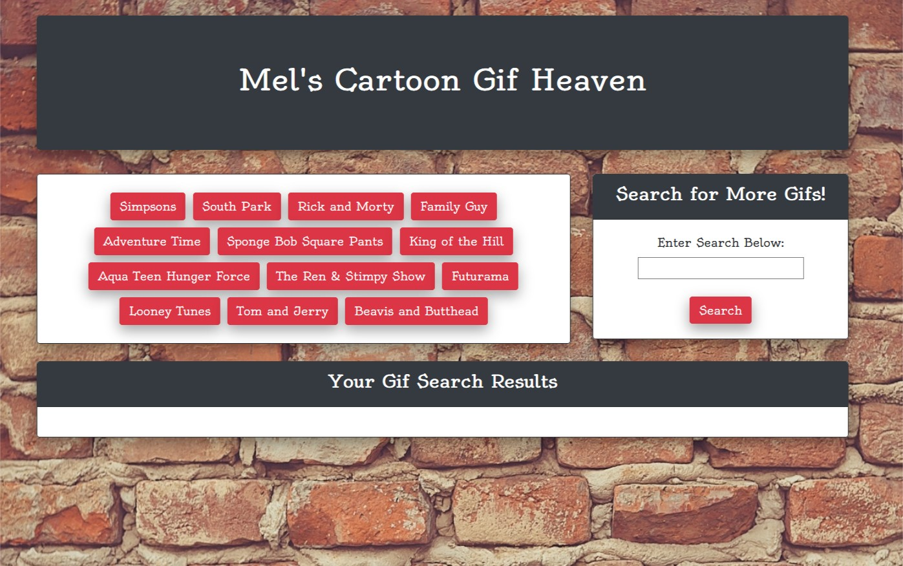
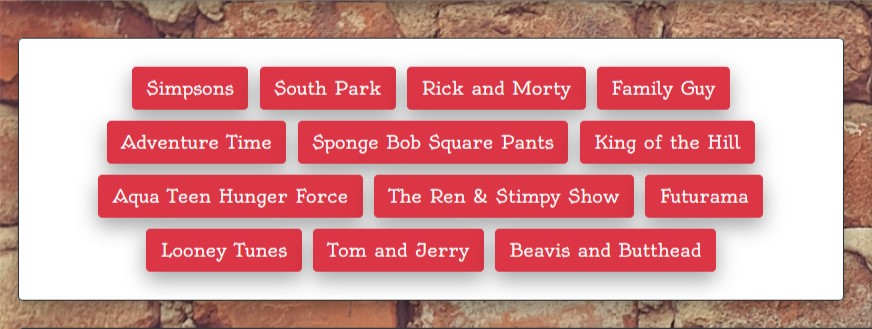
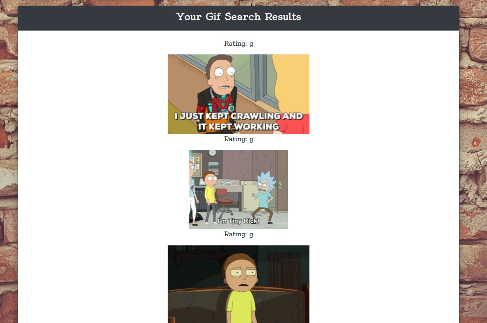
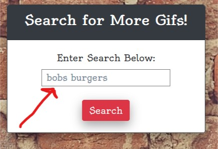

# giphyAPI
------
## live app: https://melvynling.github.io/giphyAPI/

## Objective
The point of this app is to allow the user to search the giphy database of gifs for gif of their choosing, and  

Keywords:
##### API 
>API - Application Programming Interface, the go between to allow two applications to communicate to each other, setting the rules and how the applications should interact with each other. 

##### AJAX 
>AJAX - the art of exchanging data with a server, and update parts of a web page - without reloading the whole page.

## Overview
In this App, an Ajax API Call is done using the giphy API. 
The app is meant to allow the user to search the giphy database for a gif of their chosing. 
The theme of the App is cartoon, so a set of button have been laid out, allowing the user to select a cartoon and see gifs associated with them. There is also a search input to allow the user to search for gif. 
The area beneath the buttons and search area present the user with the gifs they have selected. 

## Instructions/Walkthrough: 
as the page loads, the user is presented with a series of buttons to choose cartoon themed gifs onthe left as well as a search input to search gifs on the right. Below these is an area where the selected or searched gifs can load. 

the buttons work as follows: 
  >
  > * click on a button to select one of the preset cartoon themes. 
  > * once clicked, the gifs will load below in the search result area. 
  >
  > * once loaded, the user can click on the gif to play it and then click on it to pause it as well. 

the search input works as follows:
  >
  > * type in the desired gif search in search input area.
  > * Once typed, hit submit. This should return the desired search results  as a button in the button area.
  > * once the button shows, click on it and the gifs will load below in the search result area. 
  >
  > * once loaded, the user can click on the gif to play it and then click on it to pause it as well. 

